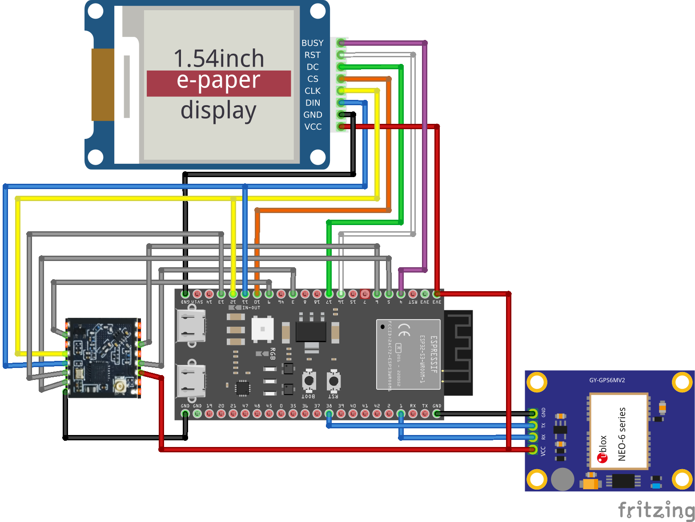

# 📌 專題名稱：登山緊急通訊器

## 📌 專題描述
建立低功耗、低成本、可在無行動網路環境下運作的團隊通訊系統。登山活動常發生在手機無訊號的地區，隊伍若分散將難以聯絡。本專題旨在解決此問題，實現位置回報、狀態訊息、SOS 廣播等功能。

## 📌 研究重點
- **研究問題或技術核心**：
  - FreeRTOS: 多線程Task、Loop同時運行
  - LoRa 通訊：利用 LoRa 通訊交換裝置間的位置，製作簡單Mesh網路。
  - GPS 定位：利用 GPS 模塊定位裝置位置。
  - 嵌入式 Low Power Design：寫出省電的程式，在適當時間進入睡眠，關閉不必要的功能。

## 📌 相關功能
- 多人互相分享位置。
- 顯示登山路徑、紀錄活動軌跡。
- 去中心化網路：任何設備都可以轉發消息增加傳輸距離。
- 離網通訊。
- 一鍵 SOS 廣播與持續信號追蹤。
- 脫隊警報（路徑偏離過大）。

## 📌 測試裝置
- ESP32-S3
- HT-RA62(SX1262) - Lora通訊模組
- NEO-6MV2 - GPS模組
- E-Paper

## 📌 測試App
- [**Android Companion App**](https://github.com/ccu412430024/LoRa-Mountain-Communication-Android)

## 📌 License
- [**LoRaMesher (MIT license)**](https://github.com/LoRaMesher/LoRaMesher)
